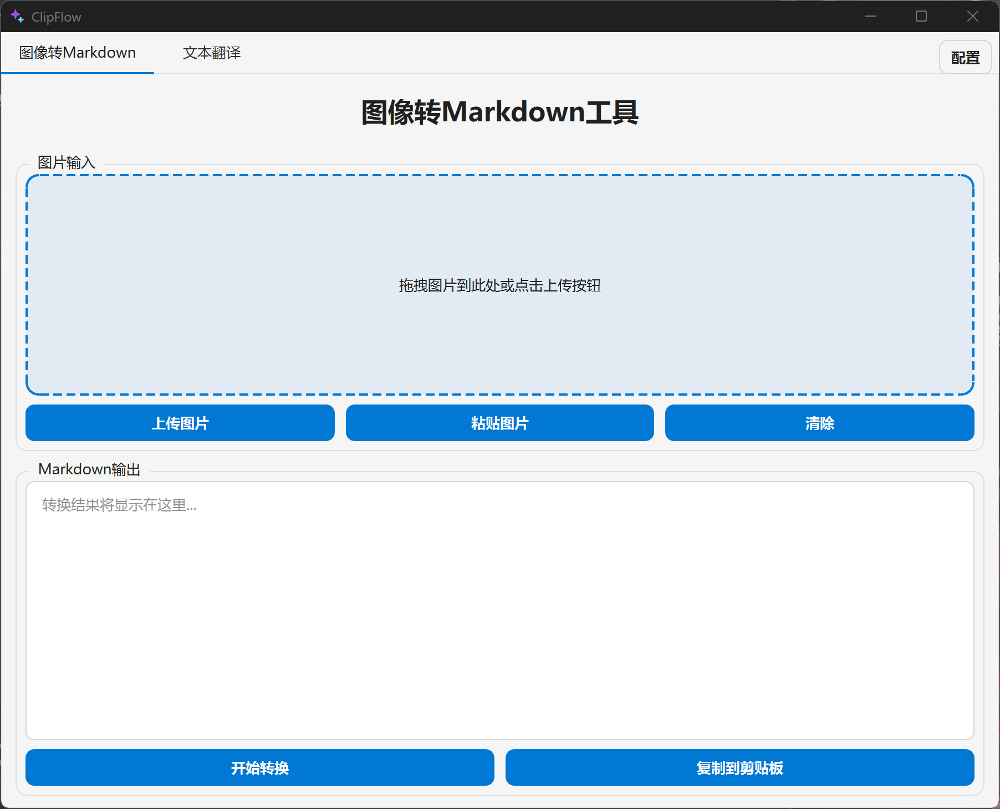
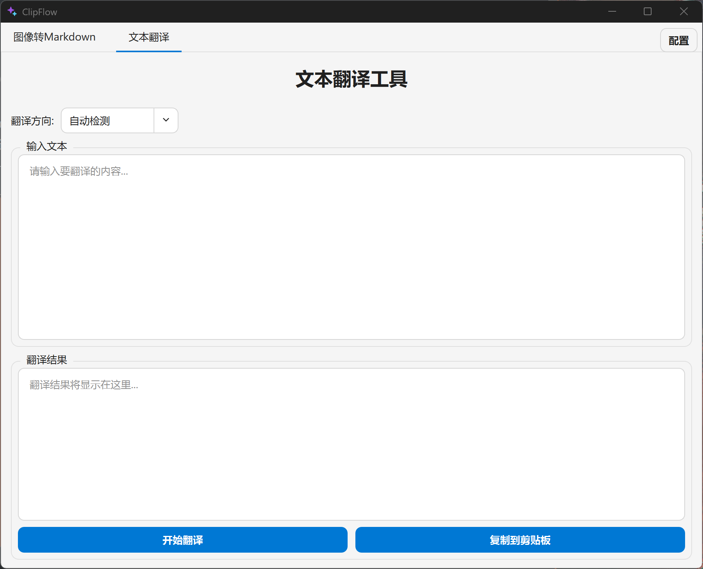
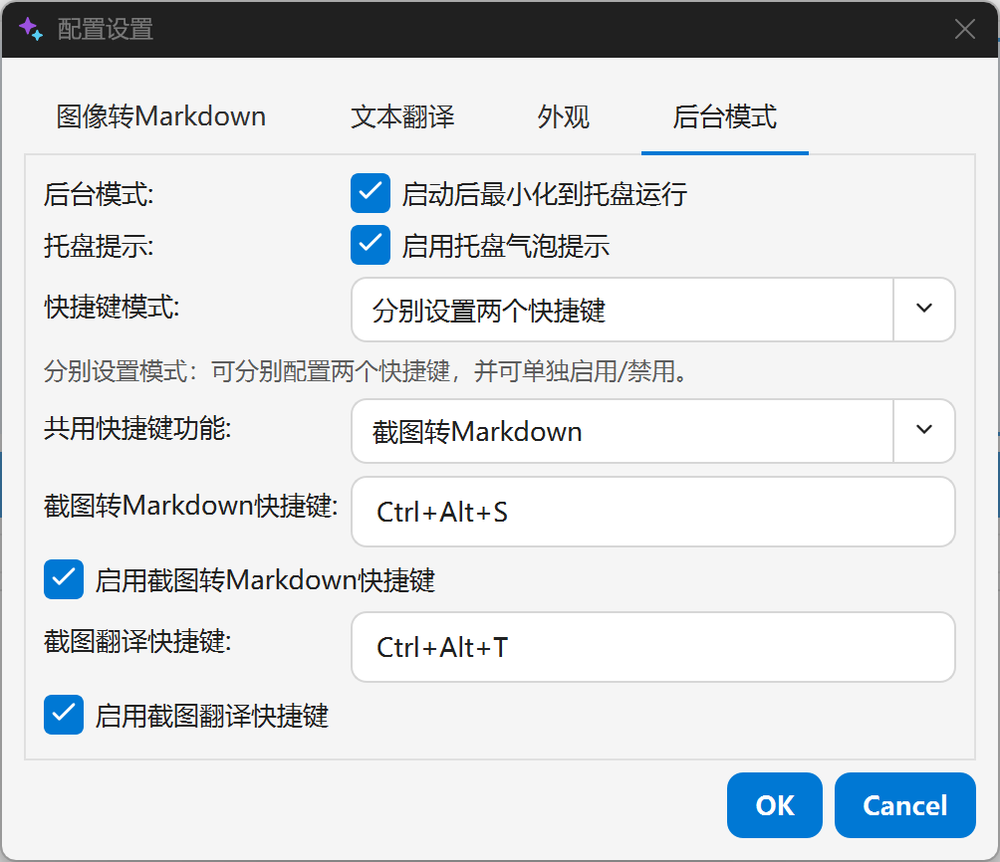
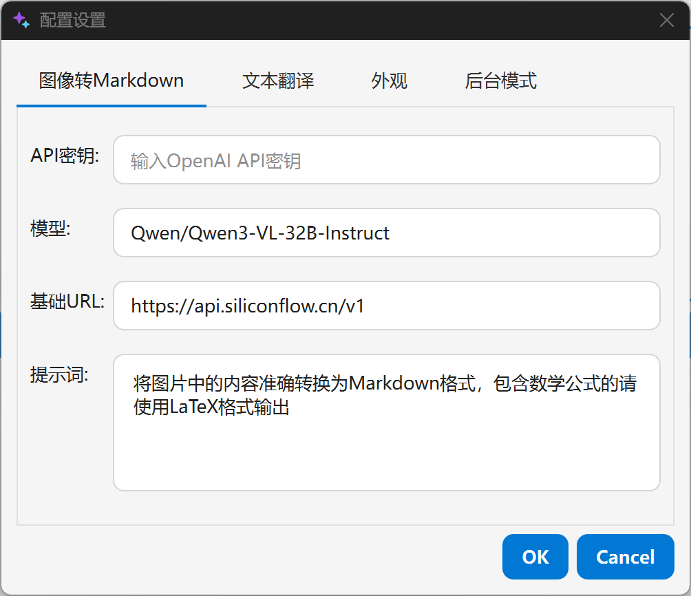
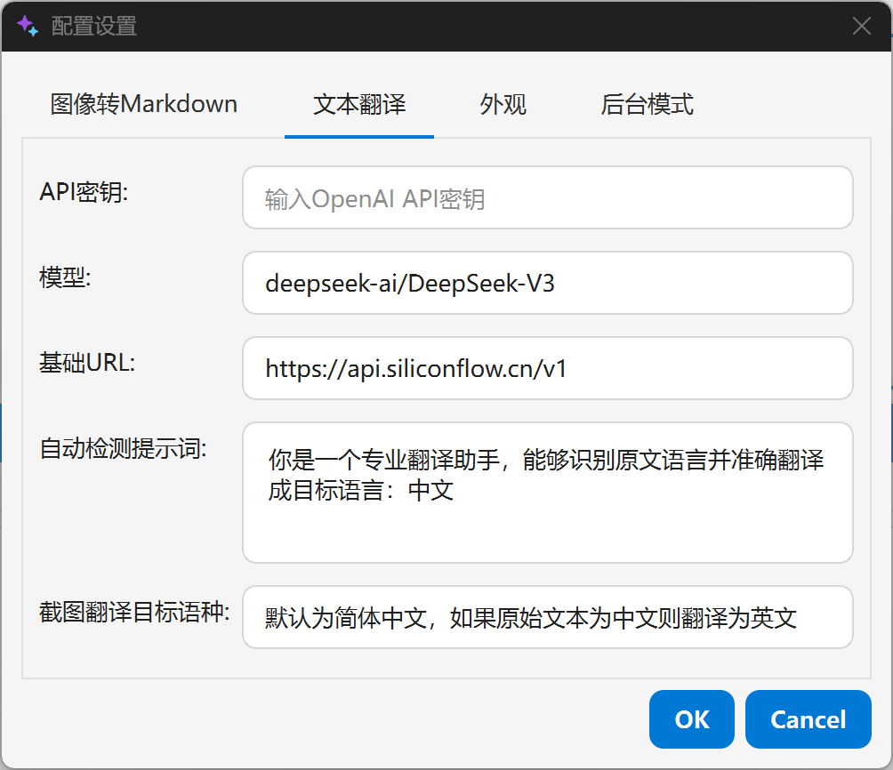

# ClipFlow

ClipFlow 是一个 Windows 桌面效率工具（Qt 6 / C++），提供托盘常驻与全局快捷键能力：通过区域截图触发 AI 识别与处理链路（文本OCR、翻译），并将结果自动写入剪贴板，提升“截图→内容复用”的效率。





## 功能特性

- **后台模式（托盘常驻）**
  - 启动后最小化到托盘
  - 托盘右键菜单：显示/隐藏、截图转 Markdown、截图翻译、取消当前任务、配置、退出
  - 可选托盘气泡提示（成功/失败/取消）
- **全局快捷键**
  - 支持两种模式：
    - **共用一个快捷键**：仅注册一个快捷键，触发功能由“共用快捷键功能”决定（截图转 Markdown / 截图翻译）
    - **分别设置两个快捷键**：分别配置“截图转 Markdown”与“截图翻译”的快捷键，并可单独启用/禁用
  - 快捷键冲突时会回退到默认组合键



- **截图转 Markdown（视觉模型）**
  - 区域截图（遮罩选区，Esc 取消）
  - 将截图上传到 OpenAI 兼容接口（Vision）
  - 生成 Markdown 并自动写入剪贴板



- **截图翻译（视觉模型）**
  - 区域截图 → 识别图片文字 → 翻译到目标语种
  - 翻译结果自动写入剪贴板
  - 可配置目标语种（例如：简体中文 / English / 日本語）



- **文本OCR与翻译（窗口模式）**
  - 支持手动上传、拖拽、一键粘贴图片
  - 支持自动检测与多种翻译方向
  - 一键复制文本识别/翻译结果到剪贴板
- **主题（外观）**
  - 暗黑 / 明亮 / 跟随系统

## 快速开始（用户）

1. 启动程序
2. 打开“配置”，填写 API Key / Base URL / 模型等信息
3. 开启“后台模式”并设置快捷键
4. 使用全局快捷键触发截图识别或截图翻译，结果会自动进入剪贴板

## 配置文件（config.json）

- 程序读取/写入位置：与 `ClipFlow.exe` 同目录的 `config.json`
- 该文件可能包含 API Key，注意防止分享泄露

关键字段示例（完整示例可参考 `build/bin/config.json`）：

```json
{
  "background": {
    "start_in_tray": true,
    "tray_bubbles_enabled": true,
    "hotkey_mode": "shared",
    "shared_hotkey_action": "ocr",
    "screenshot_hotkey": "Ctrl+Alt+S",
    "translate_hotkey": "Ctrl+Alt+T",
    "screenshot_hotkey_enabled": true,
    "translate_hotkey_enabled": true
  },
  "image_to_markdown": {
    "api_key": "sk-xxxx",
    "base_url": "https://api.openai.com/v1",
    "model": "gpt-4-vision-preview",
    "prompt": "将图片中的内容准确转换为Markdown格式，包含数学公式的请使用LaTeX格式输出"
  },
  "translation": {
    "api_key": "sk-xxxx",
    "base_url": "https://api.openai.com/v1",
    "model": "gpt-4",
    "prompt_auto": "你是一个专业翻译助手，能够识别原文语言并准确翻译成目标语言：",
    "screenshot_target_language": "简体中文"
  },
  "ui": {
    "theme": "system"
  }
}
```

## 项目结构（Project Tree）

当前仓库主要目录结构如下（以仓库根目录为起点）：

```text
ClipFlow/
├─ assets/
│  └─ icons/                图标资源（SVG/ICO 源文件）
├─ resources/
│  ├─ qt/
│  │  └─ resources.qrc      Qt 资源清单（编译进 exe，运行时用 :/assets/... 访问）
│  └─ windows/
│     └─ app.rc             Windows 可执行文件图标资源（编译进 exe）
├─ src/                     核心源码（Qt Widgets / C++）
│  ├─ main.cpp              程序入口（加载配置、处理 --tray 参数、启动主窗口）
│  ├─ mainwindow.*          主窗口、托盘菜单、全局快捷键绑定、截图触发入口、主题应用
│  ├─ config.h              配置结构定义 + JSON 映射（config.json）
│  ├─ configmanager.*       配置文件读写（与 ClipFlow.exe 同目录的 config.json）
│  ├─ configdialog.*        “配置”对话框（API Key/模型/后台模式/快捷键/主题等设置）
│  ├─ app_style.*           Fluent 风格主题样式（暗黑/明亮/跟随系统）与 QSS 生成
│  ├─ rounded_menu.*        托盘右键菜单的真圆角实现（Popup 窗口 mask）
│  ├─ globalhotkey.*        Windows 全局快捷键（RegisterHotKey/WM_HOTKEY）
│  ├─ region_capture_overlay.* 区域截图遮罩层（鼠标拖拽选区、Esc 取消、截屏）
│  ├─ openai_chat_client.*  OpenAI 兼容 Chat Completions 客户端封装（Network）
│  ├─ image_to_markdown_runner.* 截图/图片 → Vision → Markdown 的执行器
│  ├─ image_to_translation_runner.* 截图 → 识别+翻译 的执行器（结果写入剪贴板）
│  ├─ markdown_utils.*      Markdown 清洗（去掉 ``` 包裹等）
│  ├─ imagetab.*            “图像转Markdown”窗口页
│  ├─ translationtab.*      “文本翻译”窗口页
│  ├─ droplabel.*           拖拽/点击图片输入控件（用于 ImageTab）
│  └─ image_preview_dialog.* 图片预览对话框
├─ build/                   构建目录（构建产物，用于本机调试，不包含在git仓库中）
├─ dist/                    分发目录（windeployqt 打包输出，不包含在git仓库中）
├─ CMakeLists.txt           CMake 构建入口
├─ .gitignore
└─ README.md
```

说明：
- `dist/` 用于产出可分发目录，`build/` 仅用于本机开发构建。
- Qt 资源（`resources.qrc` + `app.rc`）会编译进 `ClipFlow.exe`，运行时不需要额外拷贝图标文件。

## 开发与发布（Build / Release）

### 目录约定

- `src/`：Qt C++ 源码
- `assets/icons/`：图标源文件（SVG/ICO）
- `resources/qt/resources.qrc`：Qt 资源清单（编译进 exe，运行时用 `:/assets/...` 访问）
- `resources/windows/app.rc`：Windows exe 图标资源（编译进 exe）
- `build/`：构建目录（中间产物、以及本机调试用的可执行文件）
- `dist/`：分发目录（发布给其他机器运行的最终目录，建议只放打包产物）

### 构建环境

- Qt：`D:\Soft-Programs\Qt\6.11.1\mingw_64`（需要根据你实际的QT安装路径修改）
- 编译器：`D:\Soft-Programs\Qt\Tools\mingw1310_64`
- CMake：`D:\Soft-Programs\Qt\Tools\CMake_64\bin\cmake.exe`
- Ninja：`D:\Soft-Programs\Qt\Tools\Ninja\ninja.exe`

### 本地构建（开发者）

在项目根目录执行（实际指令需要根据你的本地QT安装路径做修改）：

```powershell
D:\Soft-Programs\Qt\Tools\CMake_64\bin\cmake.exe -S . -B build -G Ninja `
  -DCMAKE_PREFIX_PATH=D:/Soft-Programs/Qt/6.11.1/mingw_64 `
  -DCMAKE_CXX_COMPILER=D:/Soft-Programs/Qt/Tools/mingw1310_64/bin/g++.exe `
  -DCMAKE_MAKE_PROGRAM=D:/Soft-Programs/Qt/Tools/Ninja/ninja.exe

D:\Soft-Programs\Qt\Tools\CMake_64\bin\cmake.exe --build build
```

构建输出（开发目录）：

- `build/bin/ClipFlow.exe`

### 运行（开发者）

临时补齐 Qt 运行时依赖（仅对当前 PowerShell 会话生效）：

```powershell
$env:PATH="D:\Soft-Programs\Qt\6.11.1\mingw_64\bin;$env:PATH"
.\build\bin\ClipFlow.exe
```

后台托盘模式：

```powershell
.\build\bin\ClipFlow.exe --tray
```

### 分发（发布给其他机器）

#### 推荐目标目录

建议输出到 `dist/ClipFlow/`，保持 `build/` 纯粹用于本机构建。

#### 打包命令（windeployqt）

在项目根目录执行：

```powershell
New-Item -ItemType Directory -Force -Path .\dist\ClipFlow | Out-Null
Copy-Item -Force .\build\bin\ClipFlow.exe .\dist\ClipFlow\

D:\Soft-Programs\Qt\6.11.1\mingw_64\bin\windeployqt.exe .\dist\ClipFlow\ClipFlow.exe
```

如需给用户提供初始配置，可手动将一个不包含真实密钥的 `config.json` 放入 `dist/ClipFlow/`。

#### 分发目录内容检查

`dist/ClipFlow/` 至少应包含：

- `ClipFlow.exe`
- `Qt6Core.dll / Qt6Gui.dll / Qt6Widgets.dll / Qt6Network.dll / Qt6Svg.dll` 等依赖
- `platforms/qwindows.dll` 等 Qt plugins

### 清理构建目录

彻底清理推荐直接删除整个 `build/` 目录后重新配置构建：

```powershell
Remove-Item -Recurse -Force .\build
```
